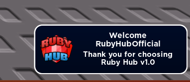
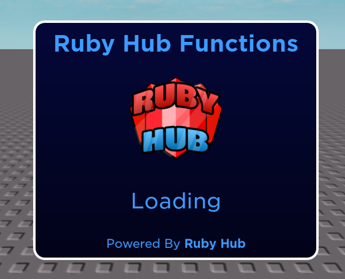
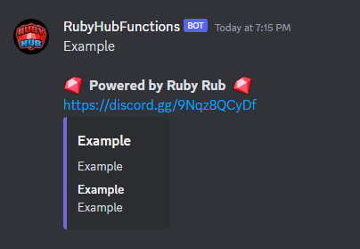
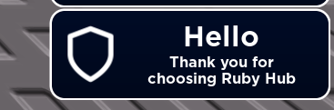
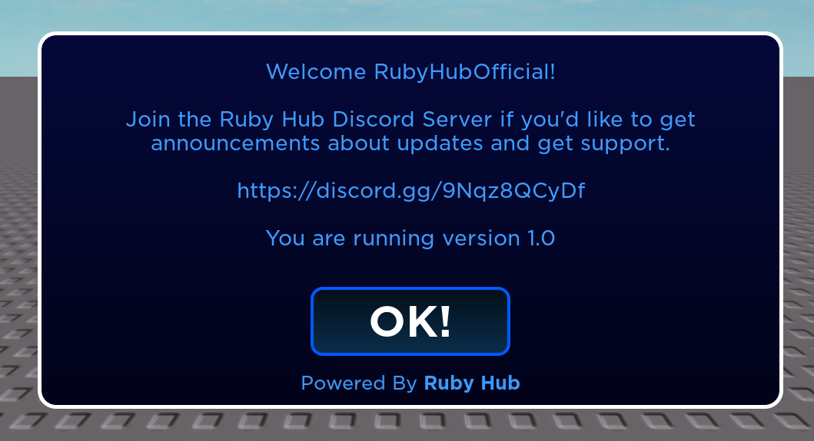

# Ruby Hub Functions
These docs are inspired by Orion Libraries doc layout for an easy and user friendly experience.\
Ruby Hub Functions can be run with or without the Configs table, running without uses the default settings.\
Ruby Hub Data is still in early development, expect bugs | Suggestions are always welcome in our discord server

Join Discord Server For Updates + Support: https://discord.gg/9Nqz8QCyDf \
Donate $1.50+ USD for a supporter role + Help fund Ruby Hub Functions: https://RubyHub.sellix.io/product/64a083ab643ea \

Some of the things here are rewrites of base functions that Roblox Provides or Custom Versions of things that Roblox May or May Not have.
Everything here can be found online through various scripting sites but some of them can contain a hefty amount of code, hance why I've made it so you can call them in a sing line.

## Starting Up Ruby Hub Functions
```lua
local Configs = {
    StartupNotification = true, -- Toast Notification On Startup: default = true
    StartupAnimation = true, -- Loading Animation On Startup: default = true
    ErrorToastNotifications = true -- Toast Notifications For Errors: default = false
}

RubyHubFunctions = loadstring(game:HttpGet("https://raw.githubusercontent.com/RubyScriptsOnTop/RubyHubFunctions/main/source"))(Configs)
```



## Sending A Webhook
```lua
ReturnedData = RubyHubFunctions.SendWebhook({
    WebhookUrl = "https://discord.com/api/webhooks/xxxxxxxxxxxxxxxxxxx/xxxxxxxxxxxxxxxxxxxxxxxxxxxxxxxxxxxxxxxxxxxx-xxxxxxxxxxxxxxxxxxxx_xx",
    WebhookBody = {
        ["content"] = "Example",
        ["embeds"] = {
            {
                ["title"] = "Example",
                ["description"] = "Example",
                ["type"] = "rich",
                ["color"] = tonumber(0x7269da),
                ["fields"] = {
                    {
                        ["name"] = "Example",
                        ["value"] = "Example"
                    }
                },
            }
        }
}})

--[[
    WebhookUrl: string - URL to Webhook
    WebhookBody: table - Webhook Contents

    Returns Request Data
]]
```


## Sending A Custom Toast Notification
```lua
RubyHubFunctions.ToastNotification({
    Title = "Hello", -- default = "Ruby Hub Notification"
    Text = "Thank you for choosing Ruby Hub", -- default = "Join Ruby Hub! | https://discord.gg/9Nqz8QCyDf"
    Icon = RubyHubFunctions.Icons.Announcement, -- default = none
    Duration = 5 -- default = 5
})

--[[
    Title: string - Title of Notification
    Text: string - Description of Notification
    Icon: string - Icon on Notification | "rbxassetid://<imageid>" or RubyHubFunctions.Icons.<IconName> (Listed at bottom of documentation)
    Duration: number | int - Duration of Notification [In Seconds]
]]
```


## Startup Animation
```lua
RubyHubFunctions.StartupAnimation({
    Title = "Ruby Hub Functions", -- default = "Ruby Hub Functions"
    LoadingText = "Loading...", -- default = "Loading..."
    Icon = RubyHubFunctions.Icons.RubyHubNoBG -- default = RubyHubFunctions.Icons.RubyHubNoBG
})

--[[
    Title: string - Title of Startup Animation
    LoadingText: string - Text Displayed Under Icon
    Icon: string - Icon on Startup Animation | "rbxassetid://<imageid>" or RubyHubFunctions.Icons.<IconName> (Listed at bottom of documentation)
]]
```


## Send User Prompt
```lua
RubyHubFunctions.Prompt({
        Text = "Welcome " .. RubyHubFunctions.GetLocalPlayer().Name .. "!\n\nJoin the Ruby Hub Discord Server if you'd like to get announcements about updates and get support.\n\nhttps://discord.gg/9Nqz8QCyDf\n\nYou are running version " .. RubyHubFunctions.Data.ScriptVersion, -- default = "Thank you for choosing Ruby Hub Functions"
    ["Button1"] = {
        Visible = true, -- default = false
        Text = "OK!" -- default = "Close"
    },
    ["Button2"] = {
        Visible = false, -- default = false
        Text = "2" -- default = none
    },
    ["Button3"] = {
        Visible = false, -- default = false
        Text = "3" -- default = none
    },
    ["No"] = {
        Visible = false, -- default = false
    },
    ["Yes"] = {
        Visible = false, -- default = false
    },
    Callback = {
        ["Button1"] = function()
                
            RubyHubFunctions.ToastNotification({
                Title = "Enjoy",
                Text = "We hope you enjoy using Ruby Hub",
                Icon = RubyHubFunctions.Icons.Success,
                Duration = 2.5
            })

        end
        --[[ default
        ["ButtonName"] = function()

            print("Clicked " .. ButtonName.Name)

        end]]
    }
})
```


## Set Rendering
```lua
RubyHubFunctions.SetRendering(false) -- boolean | true = Normal Game Rendered in 3d / false = Game Not Rendered in 3d
```

## Set Quality
```lua
RubyHubFunctions.SetQualityLevel(5) -- number | int <1-21> - Sets Game Quality Level
```

## Enable Anti Afk
```lua
RubyHubFunctions.AntiAfk() -- Turns on Anti Afk to Prevent Disconnect For Being Idle
```

## Teleport To Game
```lua
RubyHubFunctions.TeleportToGame(953932652) -- number | int - Teleports You to Game With Corresponding Game Id
```

## Teleport To Location
```lua
RubyHubFunctions.TeleportToLocation(CFrame.new(0, 100, 0)) -- CoordinateFrame - Teleports Character to Location
```

## Teleport To Part
```lua
RubyHubFunctions.TeleportToPart(Workspace.Baseplate) -- instance | basepart/meshpart/union - Teleports Character to Part
```

## Set WalkSpeed
```lua
RubyHubFunctions.SetWalkSpeed(16) -- number | int - Sets Characters Walkspeed
```

## Set JumpPower
```lua
RubyHubFunctions.SetJumpPower(16) -- number | int - Sets Characters JumpPower
```

## Spoof Players
Can Crash in Large Games
- Spoofs Leaderboard
- Spoofs Chat
- Spoofs Name Above Avatar
- Sometimes Spoofs All Instances Of Player Name/Display Name [idk why it only works sometimes]
- Once Spoof Enabled Players That Join Get Auto Spoofed
```lua
RubyHubFunctions.SpoofPlayers("RubyHub") -- string - Spoofs Players Names: default = "RubyHub"
```

# Extra Data
```
-- Preset Icons | Callable Using RubyHubFunctions.Icons.<IconName>
RubyHubFunctions.Icons = {
    RubyHub = "rbxassetid://13774734087",
    RubyHubNoBG = "rbxassetid://11798038990",
    Crown = "rbxassetid://13914062474",
    Visible = "rbxassetid://13914062067",
    Invisible = "rbxassetid://13914062329",
    QuestionMark = "rbxassetid://13914062201",
    Yeild = "rbxassetid://13914061884",
    Badge = "rbxassetid://13914062638",
    Announcement = "rbxassetid://7734056608",
    Success = "rbxassetid://7734056411",
    Warning = "rbxassetid://7734056326"
}

-- Loaded Services | Callable Using RubyHubFunctions.Services.<ServiceName>
RubyHubFunctions.Services = {
    ReplicatedStorage = game:GetService("ReplicatedStorage"),
    RunService = game:GetService("RunService"),
    UserInputService = game:GetService("UserInputService"),
    StarterGui = game:GetService("StarterGui"),
    CoreGui = game:GetService("CoreGui"),
    HttpService = game:GetService("HttpService"),
    Players = game:GetService("Players"),
    TeleportService = game:GetService("TeleportService"),
    TweenService = game:GetService("TweenService"),
    VirtualUser = game:GetService("VirtualUser")
}
```
